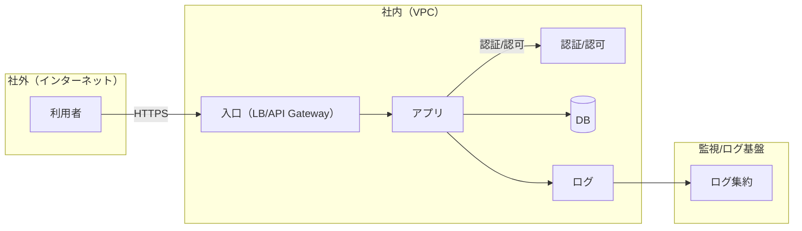
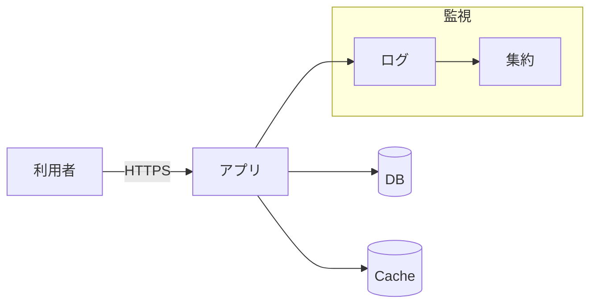

# 構成図テンプレ（Mermaid）

最小の箱と矢印で、責任分界とデータ/通信の流れを説明します。

## コピペ用テンプレ

```mermaid
flowchart LR
  %% 境界（社外/社内、VPCなど）
  subgraph Internet["社外（インターネット）"]
    User[利用者]
  end

  subgraph VPC["社内（VPC）"]
    Edge[入口（LB/API Gateway）]
    App[アプリ]
    Auth[認証/認可]
    DB[(DB)]
    Log[ログ]
  end

  subgraph Observability["監視/ログ基盤"]
    SIEM[ログ集約]
  end

  %% 通信/データの流れ
  User -->|HTTPS| Edge
  Edge --> App
  App -->|認証/認可| Auth
  App --> DB
  App --> Log
  Log --> SIEM
```

## 図（例）

```mermaid
flowchart LR
  User[利用者] -->|HTTPS| App[アプリ]
  App --> DB[(DB)]
  App --> Cache[(Cache)]

  subgraph 監視
    Log[ログ] --> SIEM[集約]
  end
  App --> Log

  %% 注釈: 重要な境界（社内/社外、VPC/インターネット）を明示する
```

## 補足（記載観点）

- 入口（誰が/どこから）
- データの保管先
- 認証/認可の境界
- 責任分界（誰がどこまで）
- 例外系（障害時/認証失敗時の遷移）
- 監視/ログの出口
