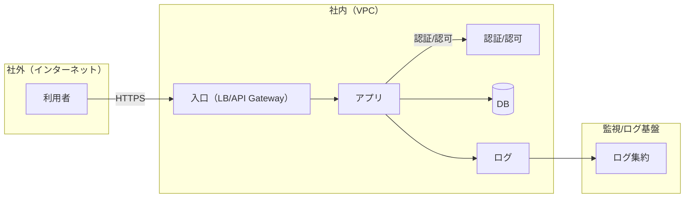
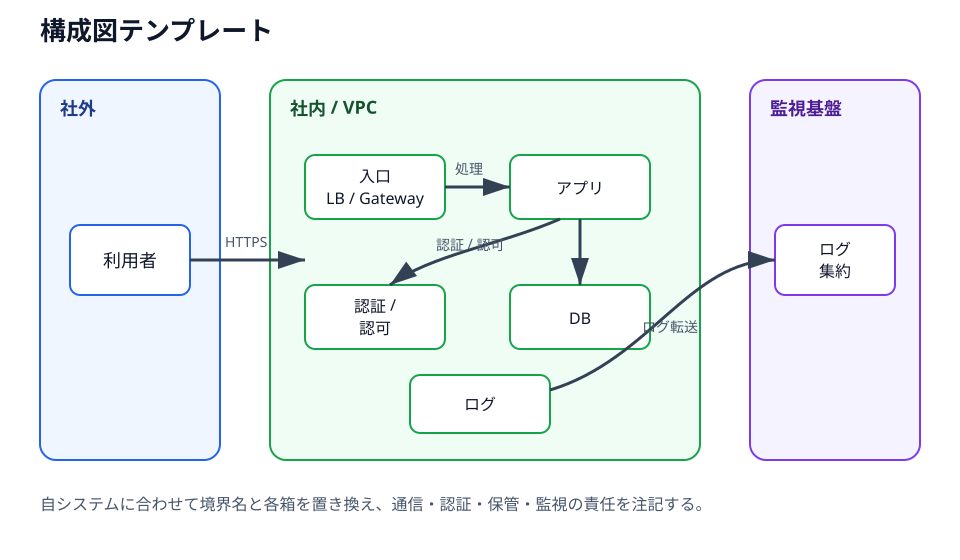
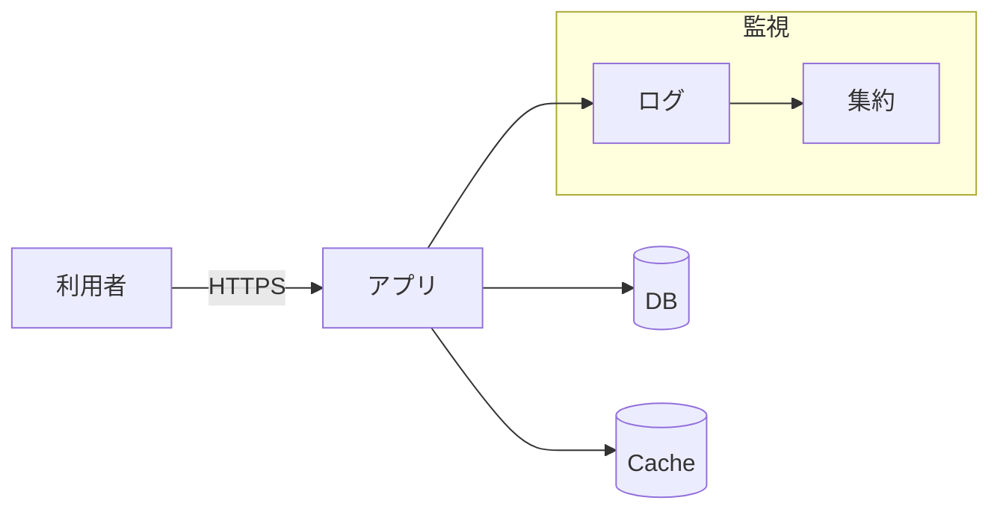
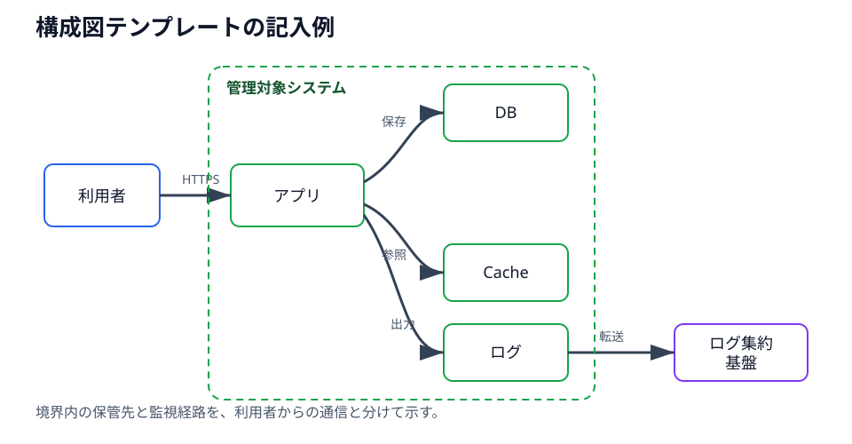

# 構成図テンプレ（Mermaid）

最小の箱と矢印で、責任分界とデータ/通信の流れを説明します。

## コピペ用テンプレ

<figure class="book-figure" id="figure-appendix-architecture-template">
  
  <figcaption>図A-1: 構成図テンプレートのプレビュー。境界、認証、データ保管、ログ出口を配置する。</figcaption>
</figure>

## 図（例）

<figure class="book-figure" id="figure-appendix-architecture-example">
  
  <figcaption>図A-2: 構成図テンプレートの記入例。主要な保管先と監視経路を最小要素で示す。</figcaption>
</figure>

## 補足（記載観点）

- 入口（誰が/どこから）
- データの保管先
- 認証/認可の境界
- 責任分界（誰がどこまで）
- 例外系（障害時/認証失敗時の遷移）
- 監視/ログの出口
