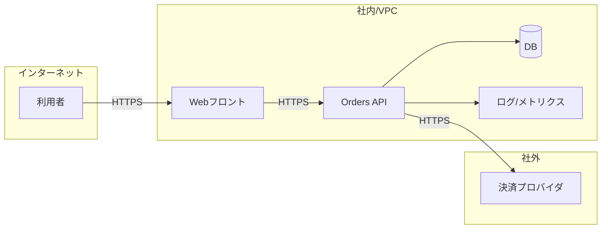
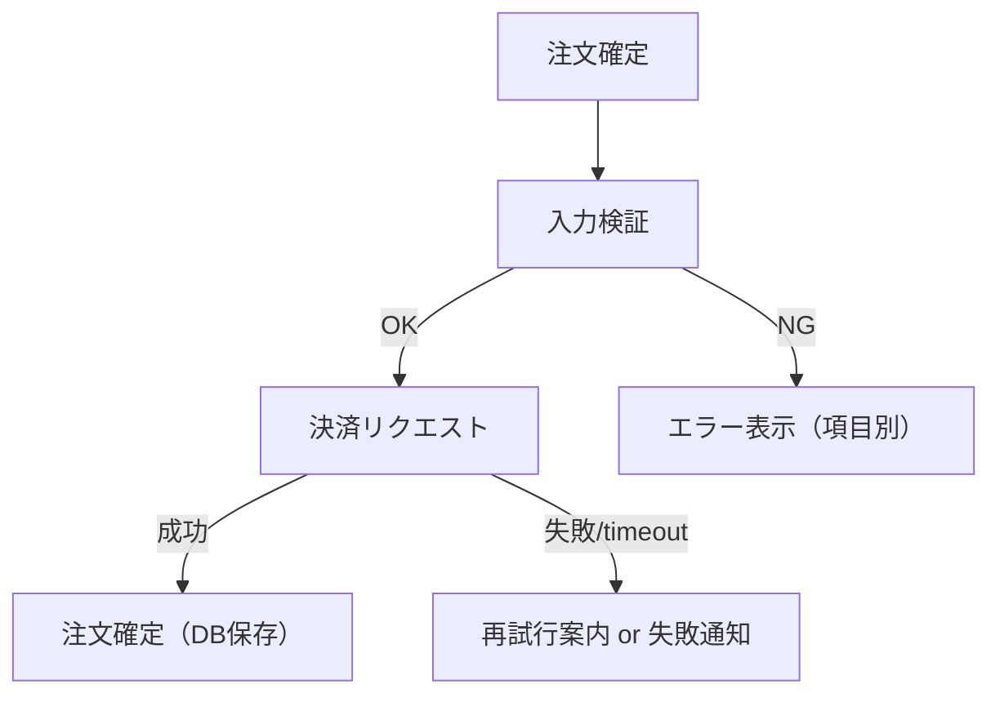
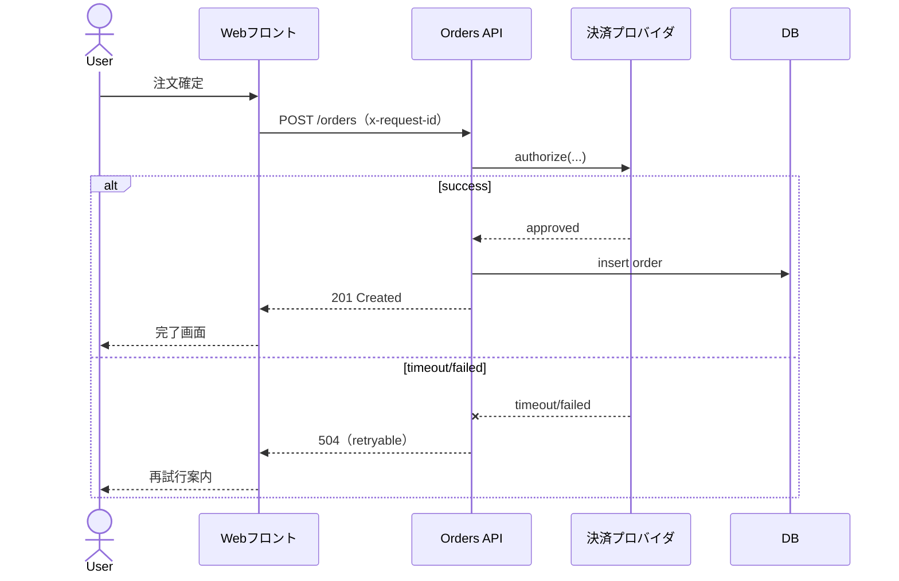

# 第5章：図解（構成図/フロー/シーケンスの最小セット）

## この章で学ぶこと

- 図解は“最小セット”で十分なことを理解する
- 構成図/フロー/シーケンスの使い分けを理解する
- Mermaid で最小の図を作る

## この章の成果物（または判断基準）

- 最小構成図（境界と責任分界が分かる）
- 図の注釈（前提/例外/制約）

## 本文

図は“全て描く”ほど読めなくなる。目的に対して最小の箱と矢印にする。

### 使い分け

- 構成図: どのコンポーネントがあるか
- フロー: どの順に処理が流れるか
- シーケンス: 誰が誰に何を送るか

図には“境界（社内/社外、VPC等）”を必ず入れる。

## 具体例（悪い例→良い例）

### 悪い例

- 全コンポーネントを詳細に描き、凡例が無い
- 境界や責任分界が分からない

### 良い例

以下は同一の架空システム（MiniShop）を前提にした例です。

#### 構成図（最小）

注釈（最低限）:

- 境界（社内/社外、VPC 等）
- 認証点（どこで認証/認可するか）
- ログ出口（どこへ送るか、マスキング方針）

#### フロー（最小）

#### シーケンス（最小）

### Mermaid の表示方針

- 本書では Mermaid 図を「コピペして使える」ことを優先し、コードブロックとして提示する
- GitHub Pages 向けのページには Mermaid 描画（JS レンダリング）を同梱していないため、図はコードとして表示される
- レンダリングが必要な場合は GitHub の Markdown 表示、VS Code 拡張、Mermaid Live Editor 等に貼り付けて確認する

## チェックリスト

- [ ] 目的（何を説明する図か）が明確
- [ ] 最小の箱と矢印になっている
- [ ] 境界と注釈がある

## まとめ

- 図解は“最小セット”でよい。境界と責任分界を明確にする
- Mermaid の最小図を用意し、認識合わせを高速化する

## 次章への接続

- 次章: [第6章](../chapter-06/)
