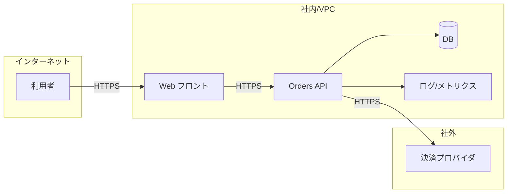
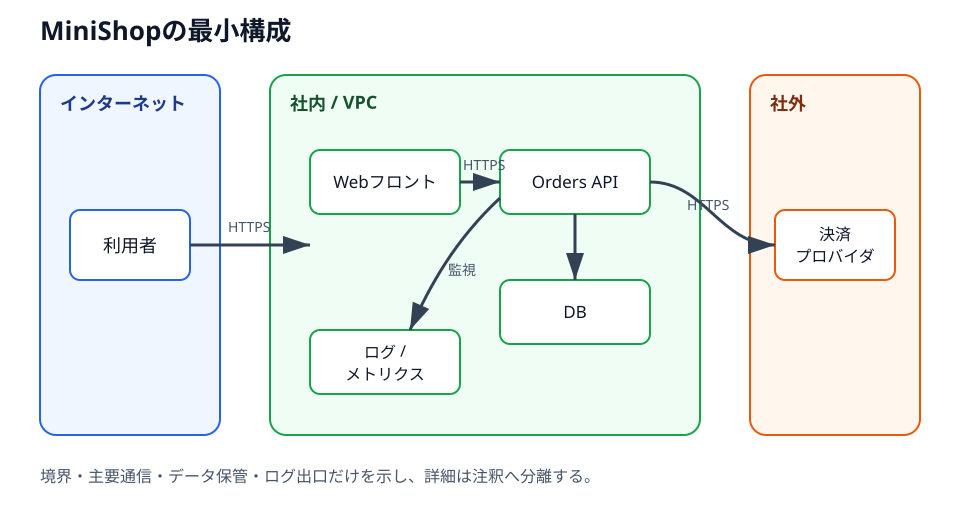
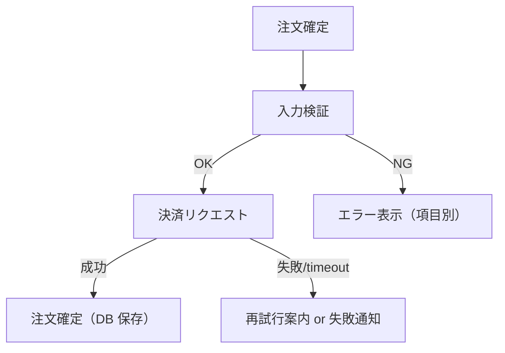
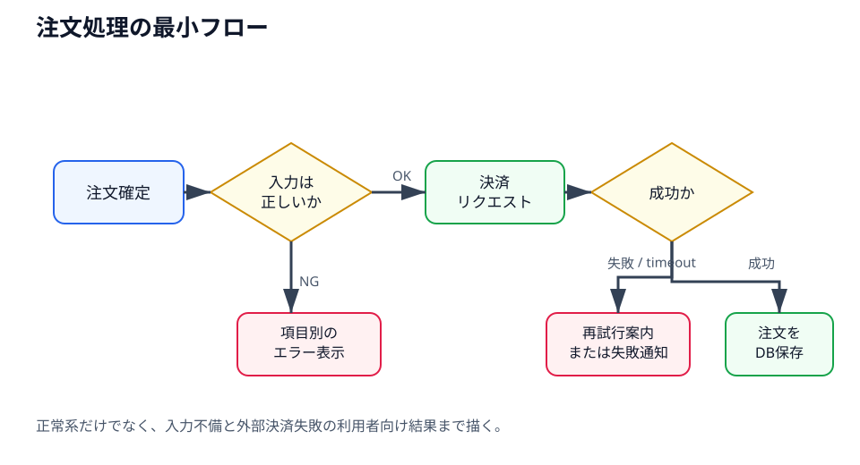
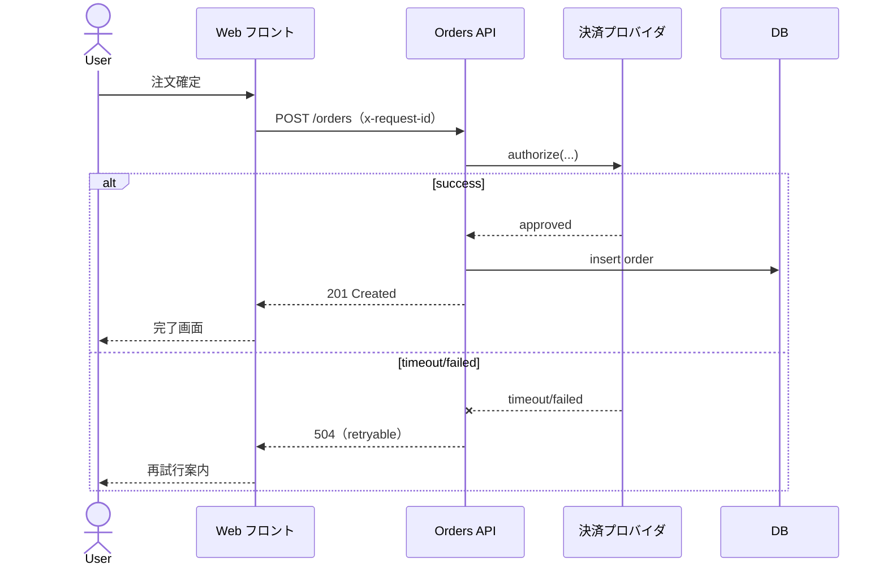
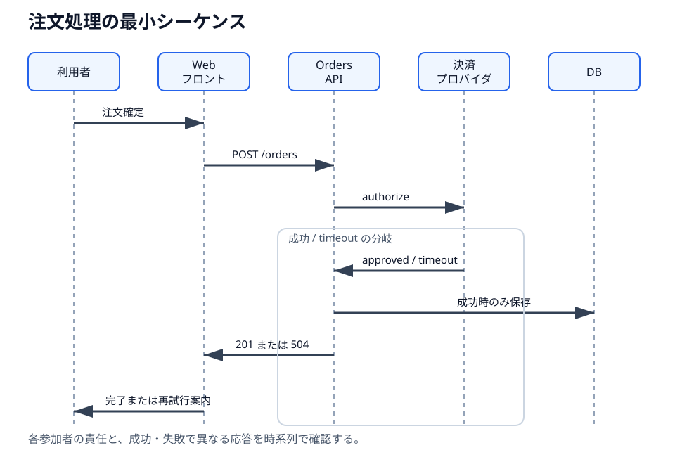

# 第5章：図解（構成図/フロー/シーケンスの最小セット）

## この章で学ぶこと

- 図解は「最小セット」で十分なことを理解する
- 構成図/フロー/シーケンスの使い分けを理解する
- Mermaid で最小の図を作る

## この章の成果物（または判断基準）

- 最小構成図（境界と責任分界が分かる）
- 図の注釈（前提/例外/制約）

## 本文

図は「すべて描く」ほど読めなくなる。目的に対して、最小限の箱と矢印に絞る。

### 使い分け

- 構成図: どのコンポーネントがあるか
- フロー: どの順に処理が流れるか
- シーケンス: 誰が誰に何を送るか

図には「境界（社内/社外、VPC など）」を必ず入れる。

## 具体例（悪い例→良い例）

### 悪い例

- 全コンポーネントを詳細に描き、凡例が無い
- 境界や責任分界が分からない

### 良い例

以下は、架空システム（MiniShop）を前提にした例です。

#### 構成図（最小）

```mermaid
flowchart LR
  subgraph Internet[インターネット]
    User[利用者]
  end

  subgraph VPC[社内/VPC]
    Web[Web フロント]
    API[Orders API]
    DB[(DB)]
    Obs[ログ/メトリクス]
  end

  subgraph External[社外]
    Pay[決済プロバイダ]
  end

  User -->|HTTPS| Web
  Web -->|HTTPS| API
  API --> DB
  API -->|HTTPS| Pay
  API --> Obs
```

<figure class="book-figure" id="figure-ch05-minimum-architecture">
  
  <figcaption>図5-1: MiniShopの最小構成。社内・社外の境界、主要通信、ログ出口を一枚で確認する。</figcaption>
</figure>

注釈（最低限）:

- 境界（社内/社外、VPC など）
- 認証点（どこで認証/認可するか）
- ログ出口（どこへ送るか、マスキング方針）

#### フロー（最小）

```mermaid
flowchart TD
  A[注文確定] --> B[入力検証]
  B -->|OK| C[決済リクエスト]
  B -->|NG| E[エラー表示（項目別）]
  C -->|成功| D[注文確定（DB 保存）]
  C -->|失敗/timeout| F[再試行案内 or 失敗通知]
```

<figure class="book-figure" id="figure-ch05-order-flow">
  
  <figcaption>図5-2: 注文処理の最小フロー。正常系と入力不備・決済失敗の分岐を分けて示す。</figcaption>
</figure>

#### シーケンス（最小）

```mermaid
sequenceDiagram
  actor U as User
  participant W as Web フロント
  participant A as Orders API
  participant P as 決済プロバイダ
  participant D as DB

  U->>W: 注文確定
  W->>A: POST /orders（x-request-id）
  A->>P: authorize(...)
  alt success
    P-->>A: approved
    A->>D: insert order
    A-->>W: 201 Created
    W-->>U: 完了画面
  else timeout/failed
    P--xA: timeout/failed
    A-->>W: 504（retryable）
    W-->>U: 再試行案内
  end
```

<figure class="book-figure" id="figure-ch05-order-sequence">
  
  <figcaption>図5-3: 注文処理の最小シーケンス。成功時とtimeout時の応答差を時系列で確認する。</figcaption>
</figure>

### Mermaid の表示方針

- 本書では、再利用できるMermaidソースをコードブロックとして保持し、その直後に公開用の静的SVGプレビューを併記する
- GitHub Pages向けのページはMermaid JavaScriptに依存せず、静的SVGで同じ構造を確認できる
- ソースを編集して再レンダリングする場合は、GitHubのMarkdown表示、VS Code拡張、Mermaid Live Editorなどで確認する

## チェックリスト

- [ ] 目的（何を説明する図か）が明確
- [ ] 最小の箱と矢印になっている
- [ ] 境界と注釈がある

## まとめ

- 図解は「最小セット」でよい。境界と責任分界を明確にする
- Mermaid の最小図を用意し、認識合わせを高速化する

## 次章への接続

- 次章: [第6章](../chapter-06/)
