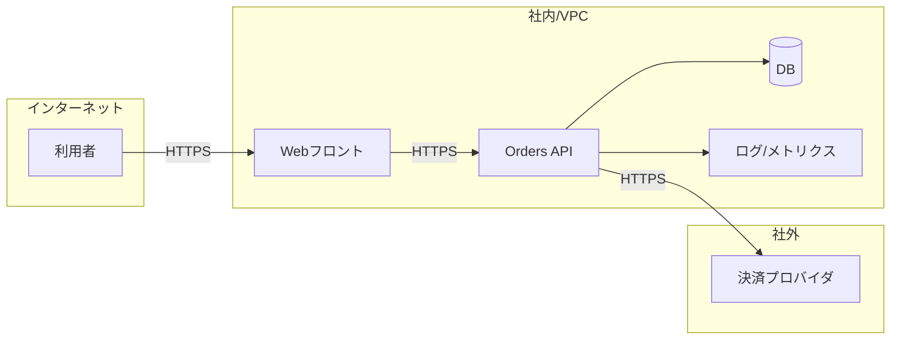

# 構成図（MiniShop）

## 目的

- MiniShop の境界（社内/社外）と責任分界、主要な依存を最小の箱と矢印で示す

## 構成図（最小）

## 注釈（最低限）

- 境界: VPC内（Web/API/DB/観測）と社外（決済プロバイダ）を分ける
- 認証点: Web→API はセッション/トークンで認可（例）。外部決済はAPIキーを利用（値は保持しない）
- ログ出口: API から観測基盤へ送る。request-id は残すが、秘密情報/個人情報はマスキングする
